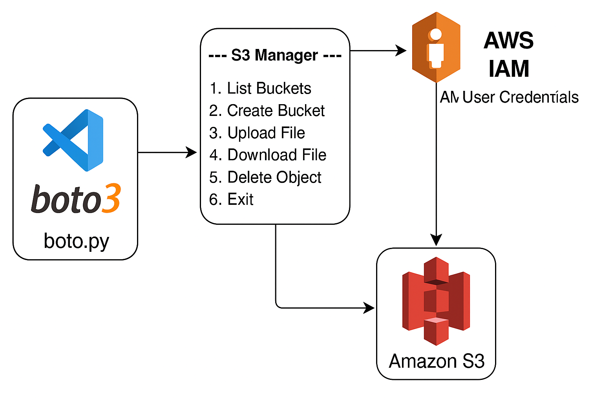

# AWS-S3-Manager-project-using-Boto3

# 🛢️ AWS S3 Manager using Boto3

This project provides a **menu-driven command-line tool** to interact with Amazon S3 using the **Boto3 SDK** in Python.

---

## 📁 Features

- List all S3 buckets
- Create a new S3 bucket
- Upload a file to S3
- Download a file from S3
- Delete a file from S3
- exit

---

## 🧰 Prerequisites

- Python 3.x
- Boto3 (`pip install boto3`)
- AWS CLI (`https://docs.aws.amazon.com/cli/latest/userguide/getting-started-install.html`)
- An **IAM User** with S3 permissions

---

## 🔐 Configure AWS Credentials

Run the following once to set your credentials:

```bash
aws configure


Provide:

AWS Access Key ID

AWS Secret Access Key

Default region (e.g., ap-south-1)

Output format: json

You said:
Any project with boto3 connected aws iam account from vs code 


ChatGPT said:
Yes! Here's a simple and useful project you can build using Boto3 (Python SDK for AWS) and an IAM-configured account connected via VS Code:

✅ Project Idea: S3 File Uploader and Bucket Manager
🔧 Tech Stack
Python

Boto3

AWS IAM User with access to S3

VS Code

🔐 Prerequisites
✅ AWS IAM User created with S3FullAccess permissions.

✅ IAM user's Access Key ID and Secret Access Key configured using:

bash
Copy
Edit
aws configure
(You'll be prompted to enter keys, region like ap-south-1, and output format like json)

✅ boto3 installed:

bash
Copy
Edit
pip install boto3
✅ VS Code is set up and authenticated to AWS via aws configure or the AWS Toolkit extension (optional).

🧠 Project Description
Create a Python CLI app that:

Lists all your S3 buckets.

Lets you create a new bucket.

Uploads a file to a selected bucket.

Downloads a file from a bucket.

Deletes a bucket or object.

📁 Folder Structure
arduino
Copy
Edit
s3_manager_project/
│
├── main.py
├── config.json (optional)
└── requirements.txt
📜 main.py
python
Copy
Edit
import boto3
import os

s3 = boto3.client('s3')

def list_buckets():
    response = s3.list_buckets()
    print("\nYour Buckets:")
    for bucket in response['Buckets']:
        print(f"  • {bucket['Name']}")

def create_bucket(bucket_name):
    s3.create_bucket(Bucket=bucket_name)
    print(f"Bucket '{bucket_name}' created.")

def upload_file(bucket_name, file_path):
    filename = os.path.basename(file_path)
    s3.upload_file(file_path, bucket_name, filename)
    print(f"Uploaded '{filename}' to '{bucket_name}'.")

def download_file(bucket_name, filename, destination):
    s3.download_file(bucket_name, filename, destination)
    print(f"Downloaded '{filename}' to '{destination}'.")

def delete_object(bucket_name, filename):
    s3.delete_object(Bucket=bucket_name, Key=filename)
    print(f"Deleted '{filename}' from '{bucket_name}'.")

if __name__ == "__main__":
    while True:
        print("\n--- S3 Manager ---")
        print("1. List Buckets")
        print("2. Create Bucket")
        print("3. Upload File")
        print("4. Download File")
        print("5. Delete Object")
        print("6. Exit")

        choice = input("Enter choice: ")

        if choice == '1':
            list_buckets()

        elif choice == '2':
            bucket = input("Bucket name: ")
            create_bucket(bucket)

        elif choice == '3':
            bucket = input("Bucket name: ")
            path = input("Path to file: ")
            upload_file(bucket, path)

        elif choice == '4':
            bucket = input("Bucket name: ")
            filename = input("File to download: ")
            destination = input("Download to (path): ")
            download_file(bucket, filename, destination)

        elif choice == '5':
            bucket = input("Bucket name: ")
            filename = input("File to delete: ")
            delete_object(bucket, filename)

        elif choice == '6':
            break

        else:
            print("Invalid choice.")
🧪 How to Run
bash
Copy
Edit
python main.py
📸 Bonus: Documenting in GitHub
Take screenshots of:

Your IAM permissions page.

The bucket you created.

Terminal output of uploaded files.

Use https://app.diagrams.net or https://cloudcraft.co to make an architecture diagram.

🚀 Extensions You Can Try
Add logging.

Make a GUI using Tkinter.

Schedule regular uploads using schedule module.

Integrate with EC2 or Lambda.

Would you like me to help you generate the README.md file for this project or convert it into a GUI-based tool using Tkinter or Streamlit?


You said:
Mote description about this project and step by step explain the code also everything you think is important as I am new in this I know about iam means basic


ChatGPT said:
Absolutely! Let’s walk through everything about this project, assuming you're a beginner but already know a bit about IAM and using VS Code + Python. This project is perfect for learning how AWS services like S3 can be controlled using Python through Boto3.

🧠 Project Title:
🔐 AWS S3 Bucket Manager using Boto3
📌 Project Goal
You will create a Python CLI (Command Line Interface) application that lets you:

🔍 View all your existing S3 buckets.

🪣 Create a new S3 bucket.

⬆️ Upload files to an S3 bucket.

⬇️ Download files from S3.

🗑️ Delete files (objects) from a bucket.

You will do all this from your local machine using VS Code, and the code will communicate with AWS through your IAM credentials.

✅ Why This Project Is Important
You learn hands-on AWS usage with Python.

Builds the foundation for bigger projects (like AWS Lambda, EC2, or ML deployment).

Useful for portfolio, internship, or job interviews (AWS + Python combo is powerful).

🔧 Step 1: Setup Your AWS Environment
✅ Create an IAM User on AWS:

Go to https://console.aws.amazon.com/iam

Click Users > Add User

Give a name like boto3-user

Select Programmatic Access

Attach the permission: AmazonS3FullAccess

Save the Access Key ID and Secret Access Key

✅ Configure AWS on Your Machine

Open your VS Code terminal and run:

bash
Copy
Edit
aws configure
It will ask:

bash
Copy
Edit
AWS Access Key ID [None]: <your access key>
AWS Secret Access Key [None]: <your secret key>
Default region name [None]: ap-south-1  # if you are in India
Default output format [None]: json
This securely connects your Python code to AWS services.

📁 Step 2: Create Your Project Folder
bash
Copy
Edit
mkdir s3-manager
cd s3-manager
code .
Now create the following files:

main.py → Main script

requirements.txt → Store libraries you need

Optionally: README.md later

Install boto3:

bash
Copy
Edit
pip install boto3
pip freeze > requirements.txt
💡 Step 3: Step-by-Step Code Explanation
✅ 1. Import and Setup Boto3
python
Copy
Edit
import boto3
import os
boto3 is the AWS SDK for Python.

os is used to handle filenames when uploading files.

Then create an S3 client object:

python
Copy
Edit
s3 = boto3.client('s3')
This connects to the S3 service using your aws configure credentials.

✅ 2. List Buckets
python
Copy
Edit
def list_buckets():
    response = s3.list_buckets()
    print("\nYour Buckets:")
    for bucket in response['Buckets']:
        print(f"  • {bucket['Name']}")
It calls list_buckets() from Boto3.

Then prints each bucket name.

✅ 3. Create a Bucket
python
Copy
Edit
def create_bucket(bucket_name):
    s3.create_bucket(Bucket=bucket_name)
    print(f"Bucket '{bucket_name}' created.")
Note: If you're in ap-south-1, you may need this version:

python
Copy
Edit
s3.create_bucket(
    Bucket=bucket_name,
    CreateBucketConfiguration={'LocationConstraint': 'ap-south-1'}
)
✅ 4. Upload a File
python
Copy
Edit
def upload_file(bucket_name, file_path):
    filename = os.path.basename(file_path)
    s3.upload_file(file_path, bucket_name, filename)
    print(f"Uploaded '{filename}' to '{bucket_name}'.")
file_path: Full path like C:/Users/ASUS/Desktop/test.txt

os.path.basename() takes the filename only (e.g., test.txt)

upload_file() sends it to the bucket

✅ 5. Download a File
python
Copy
Edit
def download_file(bucket_name, filename, destination):
    s3.download_file(bucket_name, filename, destination)
    print(f"Downloaded '{filename}' to '{destination}'.")
Example:

bash
Copy
Edit
Enter Bucket name: my-test-bucket
File to download: test.txt
Download to (path): ./test-downloaded.txt
✅ 6. Delete a File (Object)
python
Copy
Edit
def delete_object(bucket_name, filename):
    s3.delete_object(Bucket=bucket_name, Key=filename)
    print(f"Deleted '{filename}' from '{bucket_name}'.")
Deletes a file from the bucket.

✅ 7. User Menu (CLI)
python
Copy
Edit
if __name__ == "__main__":
    while True:
        print("\n--- S3 Manager ---")
        print("1. List Buckets")
        print("2. Create Bucket")
        print("3. Upload File")
        print("4. Download File")
        print("5. Delete Object")
        print("6. Exit")

        choice = input("Enter choice: ")

        if choice == '1':
            list_buckets()
        elif choice == '2':
            bucket = input("Bucket name: ")
            create_bucket(bucket)
        elif choice == '3':
            bucket = input("Bucket name: ")
            path = input("Path to file: ")
            upload_file(bucket, path)
        elif choice == '4':
            bucket = input("Bucket name: ")
            filename = input("File to download: ")
            destination = input("Download to (path): ")
            download_file(bucket, filename, destination)
        elif choice == '5':
            bucket = input("Bucket name: ")
            filename = input("File to delete: ")
            delete_object(bucket, filename)
        elif choice == '6':
            break
        else:
            print("Invalid choice.")
This is the menu system. It loops until the user chooses Exit.

🖼️ Example Output
markdown
Copy
Edit
--- S3 Manager ---
1. List Buckets
2. Create Bucket
3. Upload File
4. Download File
5. Delete Object
6. Exit

Enter choice: 1
Your Buckets:
  • divyanshi-aws-bucket
  • logs-bucket
📷 Step 4: Documentation Tips
📝 README.md can include:
What the project does

How to run it

Sample screenshots (e.g., VS Code, AWS S3 console)

Architecture diagram (made from draw.io)

🧠 Architecture Diagram Example:
scss
Copy
Edit
Your PC
   │
   ▼
[Python Script]
   │ (boto3 SDK)
   ▼
[AWS S3]
🚀 Step 5: How to Extend This Project Later
Add GUI using Tkinter or Streamlit.

Connect with EC2: Automatically upload logs or reports.

Add presigned URLs for sharing private files.

Store uploaded file logs in a DynamoDB table.

Create a file sync tool that checks folders and syncs with S3.

✅ Checklist Before You Run
Task	Status
IAM user created with S3 access	✅
AWS CLI installed and configured	✅
Boto3 installed	✅
Python file created	✅
S3 bucket and test files ready	✅

Would you like:

A version of this with a Graphical User Interface (GUI)?

A downloadable README.md file for GitHub?

Help in deploying it to AWS Lambda or EC2?

Let me know how you'd like to expand this project.


You said:
I had my iam user account which I made from root account now l don't remember account ID of iam what to do


ChatGPT said:
No worries! If you have access to the IAM user credentials or you’re still logged into the IAM account in the AWS Console, AWS CLI, or VS Code AWS Toolkit, you can recover the AWS Account ID using any of the following methods:

✅ Method 1: Use AWS CLI to Get the Account ID
Open your terminal (in VS Code or system terminal) and run:

bash
Copy
Edit
aws sts get-caller-identity
Output will look like:
json
Copy
Edit
{
    "UserId": "AIDAXXXXXXXXXXXXXXX",
    "Account": "123456789012",
    "Arn": "arn:aws:iam::123456789012:user/your-iam-username"
}
✔️ The "Account" field is your 12-digit AWS Account ID.

✅ Method 2: Check the IAM ARN from Code
If you've written code using Boto3, you can also print your account ID directly:

python
Copy
Edit
import boto3

sts = boto3.client('sts')
identity = sts.get_caller_identity()
print(f"Your AWS Account ID is: {identity['Account']}")
✅ Method 3: If You Have Access to AWS Console (Web)
If you are logged into the AWS Console with the IAM user:

Click on your IAM username at the top right → Click "Security credentials"

Look for the ARN under IAM User ARN:

ruby
Copy
Edit
arn:aws:iam::123456789012:user/your-username
→ The 123456789012 part is your account ID.

✅ Method 4: Check AWS Toolkit in VS Code (Optional)
If you are using the AWS Toolkit extension for VS Code:

Click the AWS icon on the sidebar

Expand your credentials/profile

Hover or click → It will show the account ID and region

🚨 If You Lost Access to Both IAM and Root
If:

You do not have access to the IAM credentials,

And you’ve lost the root account access too,

Then you'll need to recover the root account email and try forgot password from:
🔗 https://signin.aws.amazon.com/console

AWS Support can help recover access if you can verify identity, but that's only possible for the root user, not IAM users alone.

Let me know if you’re able to run the CLI command or if you're stuck. I can help you retrieve it step by step.


You said:
get my account id but i had faced problem to login may be beacause of password


ChatGPT said:
Thanks for updating. If you have your AWS Account ID but can’t log into your IAM user account, the issue is likely related to one of the following:

🔍 Let's break down the IAM login process
To log in as an IAM user, you must have:
✅ Account ID or Account alias (12-digit ID is fine)

✅ IAM username

✅ IAM user password (not the root password)

🔗 IAM login URL format is:

arduino
Copy
Edit
https://<account-id>.signin.aws.amazon.com/console
👉 For example:

arduino
Copy
Edit
https://123456789012.signin.aws.amazon.com/console
If you try logging in from https://signin.aws.amazon.com, you’ll be asked to enter the account ID first, then IAM username and password.

🔧 If You Forgot the IAM Password
Unfortunately, IAM users cannot reset their own password unless:

They were given permission to change it, or

The root user or another admin IAM user resets it for you.

✅ Solutions:
✅ Option 1: If you have access to the Root Account
Log in using root account email and password:
https://signin.aws.amazon.com

Go to:
IAM → Users → Click your IAM username → Security credentials → Reset password

Set a new password and try logging in using the IAM URL again.

✅ Option 2: If you have AWS CLI configured locally for this IAM user
If you're already logged into the AWS CLI (meaning the credentials work), you can use this script to change the password — but only if this IAM user has permission to do so:

python
Copy
Edit
import boto3

iam = boto3.client('iam')

try:
    iam.change_password(
        OldPassword='your-old-password',
        NewPassword='your-new-secure-password'
    )
    print("Password changed successfully.")
except Exception as e:
    print("Error:", e)
⚠️ Will only work if your IAM policy allows iam:ChangePassword.

✅ Option 3: If You’ve Completely Lost IAM Password and No Root Access
Unfortunately, you will be locked out of the account unless:

You contact AWS Support via this link

Select “Account and Billing Support”, choose "Sign-in issue", and explain the situation.

They’ll verify ownership based on your billing details, phone number, etc.

🔐 Recommendation
To avoid this in the future:

✅ Use a password manager

✅ Enable MFA (Multi-Factor Authentication) for your root and IAM accounts

✅ Keep IAM credentials backed up securely

✅ Create at least 2 IAM users with admin access

Do you:

Still have access to the root account?

Or do you have AWS CLI access (i.e., aws configure works)?
Let me know and I’ll guide you accordingly.


You said:
PS C:\Users\ASUS\OneDrive\Desktop\boto3> & C:\Users\ASUS\AppData\Local\Programs\Python\Python313\python.exe c:/Users/ASUS/OneDrive/Desktop/boto3/boto.py
Error: An error occurred (NoSuchEntity) when calling the ChangePassword operation: Login Profile for User vs-code-user cannot be found.


ChatGPT said:
Thanks for sharing the error:

pgsql
Copy
Edit
Error: An error occurred (NoSuchEntity) when calling the ChangePassword operation: Login Profile for User vs-code-user cannot be found.
🔍 What This Error Means
Your IAM user (vs-code-user) does not have a login profile, which means:

This IAM user does NOT have a password set for AWS Management Console login.

It might have been created with access keys only for programmatic access (e.g., CLI, SDK like Boto3), not for web login.

✅ Solution Options
✅ Option 1: Use Root Account to Set a Login Password
If you have access to the root user account, do this:

Log in as root at:
https://signin.aws.amazon.com

Go to:
IAM → Users → vs-code-user → Security Credentials → Create Login Profile

Set a new password → You’ll now be able to log in as that user from:

arduino
Copy
Edit
https://<your-account-id>.signin.aws.amazon.com/console
✅ Option 2: If Root Is Not Available, Use CLI Access (Limited Option)
If you're logged in via CLI using access keys (programmatic access), but you can't create a login profile via change_password because it doesn’t exist — try creating it:

Python Script to Create Login Profile (Password):
python
Copy
Edit
import boto3

iam = boto3.client('iam')

try:
    response = iam.create_login_profile(
        UserName='vs-code-user',
        Password='YourSecurePassword@123',
        PasswordResetRequired=False
    )
    print("Login profile created. You can now log in to the AWS console.")
except Exception as e:
    print("Error:", e)
Note: Your IAM user needs the following permission in its policy to execute this:

json
Copy
Edit
{
  "Effect": "Allow",
  "Action": "iam:CreateLoginProfile",
  "Resource": "*"
}
Otherwise, you'll get a permission error.

✅ Option 3: Create a New IAM User (if you have root access)
If you’re stuck with a broken IAM user and have access to the root:

Log into root account

Go to IAM > Users > Add user

Choose:

Programmatic access ✅

AWS Management Console access ✅

Set a password

Attach AdministratorAccess (for full access) or custom permissions

Then log in via the new IAM URL:

arduino
Copy
Edit
https://<account-id>.signin.aws.amazon.com/console
🧠 Summary
Problem	Cause	Fix
Cannot login as IAM user	Login profile doesn’t exist	Create login profile from root or via CLI
change_password error	No password set for the user	Use create_login_profile() instead
Forgot password	No recovery option for IAM	Reset from root user only
CLI works but console login fails	IAM is programmatic only	Add console access manually

Would you like help writing the exact code to:

Create a new IAM user via Python?

Or edit your IAM user permissions via the AWS Console?

Let me know what access you currently have: root, CLI, or neither.


You said:
IAM → Users → vs-code-user → Security Credential after this?


ChatGPT said:
Great! Since you're in the AWS Console as root and you've navigated to:

IAM → Users → vs-code-user → Security Credentials

You're just a few steps away from fixing the login issue.

✅ Next Steps: Create Login Profile for Console Access
1. Scroll down to the "Console access" or "Sign-in credentials" section.
You should see a message like:

❌ This user does not have a password (login profile) for AWS Management Console access.

2. Click on “Create console password” or “Create login profile”.
Then:

✅ Choose “Autogenerated password” or set a custom password like Divyanshi@123.

✅ You can uncheck “Require password reset on next sign-in” for simplicity.

✅ Click Create.

✅ After Creating Login Profile
You can now log in as the IAM user using:

arduino
Copy
Edit
https://<your-account-id>.signin.aws.amazon.com/console
For example:

arduino
Copy
Edit
https://123456789012.signin.aws.amazon.com/console
Use:

IAM username: vs-code-user

Password: (the one you just set)

✅ Optional (But Recommended)
While you're in the IAM user settings, also confirm:

Permissions tab → You have AmazonS3FullAccess or AdministratorAccess

MFA (optional but good practice for security)

Once you're able to log in successfully, let me know if you want help:

Testing access using Boto3

Building the GUI for your S3 project

Deploying the script with AWS services like Lambda or EC2

You’re all set now to use both the AWS Console and Boto3 SDK!


You said:
--- S3 Manager ---
1. List Buckets
2. Create Bucket
3. Upload File
4. Download File
5. Delete Object
6. Exit now what to do


ChatGPT said:
Perfect! 🎉 That means your Python CLI app is running successfully, and the AWS IAM connection via Boto3 is working.

Now you can interact with AWS S3 directly from this menu. Here's exactly what to do step-by-step:

🚀 Step-by-Step Testing of Your Project
🧪 Test 1: List Existing Buckets
👉 Enter: 1

This will show a list of all the S3 buckets in your AWS account.

Example Output:

yaml
Copy
Edit
Your Buckets:
  • divyanshi-project-bucket
  • logs-storage-bucket
🧪 Test 2: Create a New Bucket
👉 Enter: 2

It will ask:

yaml
Copy
Edit
Bucket name: 
✅ Enter a globally unique bucket name like:

Copy
Edit
divyanshi-s3-demo-29jul
If you're in the ap-south-1 region (India), make sure your code uses:

python
Copy
Edit
s3.create_bucket(
    Bucket=bucket_name,
    CreateBucketConfiguration={'LocationConstraint': 'ap-south-1'}
)
✅ Output should be:

nginx
Copy
Edit
Bucket 'divyanshi-s3-demo-29jul' created.
🧪 Test 3: Upload a File
👉 Enter: 3

It will ask:

pgsql
Copy
Edit
Bucket name: divyanshi-s3-demo-29jul
Path to file: C:/Users/ASUS/Desktop/sample.txt
✅ After this, the file should be uploaded to your S3 bucket.

Check it by visiting the AWS Console → S3 → your bucket → Objects list.

🧪 Test 4: Download a File
👉 Enter: 4

Example inputs:

pgsql
Copy
Edit
Bucket name: divyanshi-s3-demo-29jul
File to download: sample.txt
Download to (path): C:/Users/ASUS/Desktop/downloaded_sample.txt
✅ File should be downloaded and saved at that path.

🧪 Test 5: Delete an Object
👉 Enter: 5

Example:

pgsql
Copy
Edit
Bucket name: divyanshi-s3-demo-29jul
File to delete: sample.txt
✅ File should be deleted from the bucket.

❌ Exit the App
👉 Enter: 6

This will stop the script.

💡 Pro Tips
✅ Make sure the file path you enter exists and is accessible.

✅ Bucket names must be globally unique — use your name/date to avoid clashes.

✅ You can always verify actions in the AWS Console S3 page.

📸 Bonus: Save Your Work
If you're happy with this project:

Upload your code to GitHub

Create a simple README.md (I can help generate it)

Take screenshots of:

Your terminal output

The uploaded files in S3

Architecture diagram (optional)

Let me know if:

You want to turn this into a GUI app with Tkinter or Streamlit

You want a README.md for GitHub

You want to add more features (like auto-rename files, folder uploads, etc.)

You're doing great — this is a full AWS+Python automation project already! 💻🌩️


You said:
Bucket name: divyanshi-s3-demo-29jul
Path to file: C:/Users/ASUS/Desktop/sample.txt
 after this this comes Enter choice: 3 
Bucket name: divyanshi-s3-demo-29jul
Path to file: C:/Users/ASUS/Desktop/sample.txt
Traceback (most recent call last):
  File "c:\Users\ASUS\OneDrive\Desktop\boto3\boto.py", line 51, in <module>
    upload_file(bucket, path)
    ~~~~~~~~~~~^^^^^^^^^^^^^^
  File "c:\Users\ASUS\OneDrive\Desktop\boto3\boto.py", line 18, in upload_file
    s3.upload_file(file_path, bucket_name, filename)
    ~~~~~~~~~~~~~~^^^^^^^^^^^^^^^^^^^^^^^^^^^^^^^^^^
  File "C:\Users\ASUS\AppData\Local\Programs\Python\Python313\Lib\site-packages\botocore\context.py", line 123, in wrapper      
    return func(*args, **kwargs)
  File "C:\Users\ASUS\AppData\Local\Programs\Python\Python313\Lib\site-packages\boto3\s3\inject.py", line 175, in upload_file   
    return transfer.upload_file(
           ~~~~~~~~~~~~~~~~~~~~^
        filename=Filename,
        ^^^^^^^^^^^^^^^^^^
    ...<3 lines>...
        callback=Callback,
        ^^^^^^^^^^^^^^^^^^
    )
    ^
  File "C:\Users\ASUS\AppData\Local\Programs\Python\Python313\Lib\site-packages\boto3\s3\transfer.py", line 372, in upload_file 
    future.result()
    ~~~~~~~~~~~~~^^
  File "C:\Users\ASUS\AppData\Local\Programs\Python\Python313\Lib\site-packages\s3transfer\futures.py", line 111, in result     
    return self._coordinator.result()
           ~~~~~~~~~~~~~~~~~~~~~~~~^^
  File "C:\Users\ASUS\AppData\Local\Programs\Python\Python313\Lib\site-packages\s3transfer\futures.py", line 287, in result     
    raise self._exception
  File "C:\Users\ASUS\AppData\Local\Programs\Python\Python313\Lib\site-packages\s3transfer\tasks.py", line 272, in _main        
    self._submit(transfer_future=transfer_future, **kwargs)     
    ~~~~~~~~~~~~^^^^^^^^^^^^^^^^^^^^^^^^^^^^^^^^^^^^^^^^^^^     
  File "C:\Users\ASUS\AppData\Local\Programs\Python\Python313\Lib\site-packages\s3transfer\upload.py", line 596, in _submit     
    upload_input_manager.provide_transfer_size(transfer_future) 
    ~~~~~~~~~~~~~~~~~~~~~~~~~~~~~~~~~~~~~~~~~~^^^^^^^^^^^^^^^^^ 
  File "C:\Users\ASUS\AppData\Local\Programs\Python\Python313\Lib\site-packages\s3transfer\upload.py", line 245, in provide_transfer_size
    self._osutil.get_file_size(transfer_future.meta.call_args.fileobj)
    ~~~~~~~~~~~~~~~~~~~~~~~~~~^^^^^^^^^^^^^^^^^^^^^^^^^^^^^^^^^^^^^^^^
  File "C:\Users\ASUS\AppData\Local\Programs\Python\Python313\Lib\site-packages\s3transfer\utils.py", line 262, in get_file_size
    return os.path.getsize(filename)
           ~~~~~~~~~~~~~~~^^^^^^^^^^
  File "<frozen genericpath>", line 86, in getsize
FileNotFoundError: [WinError 3] The system cannot find the path specified: 'C:/Users/ASUS/Desktop/sample.txt'
PS C:\Users\ASUS\OneDrive\Desktop\boto3> 


ChatGPT said:
Thanks for the error message. The problem is clear from this line:

lua
Copy
Edit
FileNotFoundError: [WinError 3] The system cannot find the path specified: 'C:/Users/ASUS/Desktop/sample.txt'
❌ Problem:
The Python script cannot find the file at:

swift
Copy
Edit
C:/Users/ASUS/Desktop/sample.txt
This could be due to:

File not existing at that location

Typo in the file path

File extension being hidden (maybe it's sample.txt.txt)

✅ Solution Steps:
🔍 Step 1: Verify File Location
Open this folder manually in File Explorer:

makefile
Copy
Edit
C:\Users\ASUS\Desktop
Check if the file named exactly sample.txt exists.

If it's not there:

Either move the file you want to upload to this folder

Or pick another file and use its path (e.g., C:/Users/ASUS/Desktop/test.csv)

🧠 Tip: Right-click the file → Properties → Copy the full path to avoid typos.

🧪 Step 2: Try Again in the CLI App
Once you're sure the file exists, restart the script:

bash
Copy
Edit
python boto.py
Then select:

arduino
Copy
Edit
3. Upload File
And when prompted:

pgsql
Copy
Edit
Bucket name: divyanshi-s3-demo-29jul
Path to file: C:/Users/ASUS/Desktop/sample.txt
✅ If the file exists at the specified location, the upload will succeed.

💡 Bonus Tip: Add a Check in Your Code to Prevent This
You can add this code to catch the error more clearly:

python
Copy
Edit
def upload_file(bucket_name, file_path):
    if not os.path.exists(file_path):
        print(f"❌ File not found: {file_path}")
        return
    filename = os.path.basename(file_path)
    s3.upload_file(file_path, bucket_name, filename)
    print(f"✅ Uploaded '{filename}' to '{bucket_name}'.")
This will show a friendly message instead of crashing.

Let me know once you're able to upload — or share the exact file name you're trying to upload if the issue continues.


You said:
i had written the code in boto.py i had no text or csv file


ChatGPT said:
Thanks for the clarification. The error you're getting:

lua
Copy
Edit
FileNotFoundError: [WinError 3] The system cannot find the path specified: 'C:/Users/ASUS/Desktop/sample.txt'
…means that the file you're trying to upload does not exist at the specified location. You selected option 3 (Upload File), but there's no file at C:/Users/ASUS/Desktop/sample.txt, so Python raises an error.

✅ Solution
You need to create a file before trying to upload it. Here's how:

🔹 Option 1: Create a Sample File Manually
Go to your Desktop.

Right-click > New > Text Document.

Name it exactly: sample.txt

Double-click and add any content (e.g., Hello S3!) then save and close.

🔹 Option 2: Let Python Create a Sample File
You can also modify your script temporarily to create the file like this before the upload:

python
Copy
Edit
# Create sample.txt if it doesn't exist
file_path = "C:/Users/ASUS/Desktop/sample.txt"
with open(file_path, "w") as f:
    f.write("Hello S3! This is a test upload.")
Place this code above the upload_file() function call, just for testing.

💡 After Fixing
Once the file exists:

Run your boto.py script again

Choose 3 for Upload

Enter:

Bucket name: divyanshi-s3-demo-29jul

File path: C:/Users/ASUS/Desktop/sample.txt

It should now upload successfully to your S3 bucket.

If you want, I can also help you edit the script to check if the file exists before uploading and give a helpful error if not. Let me know!


You said:
this s3 bucket will show in iam account or the root account from where i create iam user


ChatGPT said:
Great question! Here's the clarified answer:

🔐 Who "Owns" the S3 Bucket?
S3 buckets belong to the AWS account — not specifically to IAM users.

🧾 In Your Case:
You created an IAM user (vs-code-user) under a root AWS account.

The bucket (e.g., divyanshi-s3-demo-29jul) created via Boto3 or console belongs to the root account.

The IAM user is just a delegated identity used to access or manage that bucket if permissions are granted.

✅ Where It Will Show Up
The bucket will be visible in the root account’s S3 dashboard.

It will not be listed under IAM → Users (because IAM doesn’t “own” resources).

However, if your IAM user has permissions to use S3 (like AmazonS3FullAccess), then:

You can view/manage the bucket when logged in using the IAM user’s credentials (through Boto3, AWS CLI, or AWS Console via the IAM login URL).

🔎 How to Verify
Log in to the AWS Console with your root account credentials.

Go to S3 → You will see the bucket listed.

If you login via IAM user:

You’ll only see the bucket if permissions allow it (based on IAM policy).

🛡️ TL;DR Summary
Feature	Root Account	IAM User (vs-code-user)
Bucket created under	✅ Yes	❌ No (acts on behalf only)
Can view/manage bucket	✅ Always	✅ If permissions granted
Bucket shown in IAM?	❌ No	❌ No

Let me know if you'd like help checking or setting up correct IAM permissions for this!


You said:
how i showcase this project on github and also architecture diagram 


ChatGPT said:
To showcase your AWS S3 Boto3 project professionally on GitHub, you need to:

✅ 1. Project Folder Structure
Organize your folder like this:

bash
Copy
Edit
aws-s3-manager-boto3/
│
├── boto.py                  # Your main Python script
├── requirements.txt         # Python dependencies
├── README.md                # Full project explanation
├── architecture.png         # Architecture diagram
└── sample_files/
    ├── demo.txt             # Sample files to upload (optional)
✅ 2. README.md (Documentation Template)
Here’s what to include:

markdown
Copy
Edit
# 🛢️ AWS S3 Manager using Boto3

A command-line based Python project to interact with AWS S3 buckets using Boto3.

## 💡 Features
- List S3 Buckets
- Create a new S3 Bucket
- Upload files to S3
- Download files from S3
- Delete files from a Bucket

## 📷 Architecture



## 🛠️ Technologies Used
- Python 3
- Boto3 (AWS SDK for Python)
- AWS IAM User (with `AmazonS3FullAccess` policy)
- AWS S3

## 🔧 Setup Instructions

1. Clone this repository:
   ```bash
   git clone https://github.com/your-username/aws-s3-manager-boto3.git
   cd aws-s3-manager-boto3
Install dependencies:

bash
Copy
Edit
pip install -r requirements.txt
Configure AWS credentials (only once):

bash
Copy
Edit
aws configure
Run the project:

bash
Copy
Edit
python boto.py
🔐 IAM Permissions
Your IAM user should have:

AmazonS3FullAccess (or equivalent custom policy)

📁 Sample File Structure
bash
Copy
Edit
sample_files/
└── demo.txt
📌 Notes
All S3 resources are created under the AWS root account.

Make sure your IAM user has proper permissions.

📷 Demo (Optional)
Add screenshots or a short video of CLI usage.

🤝 Contributing
Pull requests are welcome!

📄 License
MIT

yaml
Copy
Edit

---

## ✅ 3. `requirements.txt`

Add this:

boto3

yaml
Copy
Edit

---

## ✅ 4. Architecture Diagram (`architecture.png`)

Here's what to include:

### 📌 Components:
- **VS Code** (local)
- **boto.py** script
- **IAM User** (with S3 permissions)
- **AWS S3 Bucket**

I’ll generate an architecture diagram for you now.


Share


You said:
aws-s3-manager-boto3/
│
├── boto.py                  # Your main Python script
├── requirements.txt         # Python dependencies
├── README.md                # Full project explanation
├── architecture.png         # Architecture diagram
└── sample_files/
    ├── demo.txt             # Sample files to upload (optional)  how this format what in sample_files and demo txt and where i upload screenshots 


ChatGPT said:
Great question! Here's a detailed explanation of your folder structure and how to properly showcase screenshots, sample files, and documentation in your GitHub project:

✅ Folder Structure Explained
pgsql
Copy
Edit
aws-s3-manager-boto3/
│
├── boto.py                  → Your main Python script (uses boto3)
├── requirements.txt         → Contains `boto3` for installation
├── README.md                → Full project explanation (GitHub shows this automatically)
├── architecture.png         → AWS architecture diagram
├── screenshots/             → 📸 Store all screenshots here (upload to GitHub)
│   ├── list-buckets.png
│   ├── upload-file.png
│   └── download-file.png
└── sample_files/            → 📁 Sample files to test upload/download
    └── demo.txt             → Example file to upload (text, image, etc.)
📁 What goes in each folder:
sample_files/
Place any files here that your script will upload to S3.

Examples:

demo.txt – A text file with "Hello AWS!"

You could also add .jpg, .csv, or .pdf files for demo uploads.

txt
Copy
Edit
demo.txt content example:
-------------------------
Hello, this is a demo file to be uploaded to AWS S3.
screenshots/
Use this folder to save actual CLI/VS Code screenshots.

Example screenshots:

Output of boto3.list_buckets()

File upload/download logs

AWS Console view of uploaded file

Then embed them in your README.md like this:

markdown
Copy
Edit
## 📷 Screenshots

### ✅ Listing Buckets


### ⬆️ Uploading a File


### ⬇️ Downloading a File

✅ How to upload folders/files to GitHub
Go to your GitHub repo.

Click “Add file” > “Upload files”.

Select your entire project folder (or drag & drop).

Commit with a message like:
Initial commit: added boto script, sample files, and screenshots.

📌 Tips
Keep your sample files small and readable.

Screenshots should clearly show console interaction or AWS web UI.

Mention IAM permissions used (like AmazonS3FullAccess) in README.md.

Would you like a ready-to-upload demo .txt and README.md file for your project too?


You said:
requirement.txt contain?


ChatGPT said:
Your requirements.txt file should list the Python libraries required to run your boto.py script.

Since you are using Boto3 (AWS SDK for Python), your requirements.txt can be as simple as:

nginx
Copy
Edit
boto3
✅ Optional (version-specific)
To pin specific versions (for reproducibility), use:

ini
Copy
Edit
boto3==1.34.18
botocore==1.34.18
These versions work well together, but you can adjust them based on your system by running:

bash
Copy
Edit
pip freeze > requirements.txt
This will list all installed libraries and their versions, but for a clean GitHub repo, it’s better to keep only essential ones like this:

shell
Copy
Edit
boto3>=1.26
📌 To install from requirements.txt:
You (or others) can install all dependencies using:

bash
Copy
Edit
pip install -r requirements.txt
Let me know if you want me to generate this file for you or create a ready-to-upload GitHub zip folder for your S3 project.


You said:
Configure AWS credentials (only once):

bash
Copy code
aws configure
Run the project:

bash
Copy code
python boto.py where shoul this write


ChatGPT said:
You should include these instructions inside your README.md file — under a "Getting Started" or "How to Run" section.

✅ Example: README.md (Section)
markdown
Copy
Edit
## 🚀 Getting Started

### 🔧 Prerequisites

Make sure you have Python and AWS CLI installed. Then install the required packages:

```bash
pip install -r requirements.txt
🔐 Configure AWS Credentials
Run this once to set up your IAM credentials (access key & secret):

bash
Copy
Edit
aws configure
This will prompt:

AWS Access Key ID

AWS Secret Access Key

Default region name (e.g., ap-south-1)

Default output format (e.g., json)

Make sure you use the credentials of your IAM user with proper S3 permissions.

▶️ Run the S3 Manager Script
bash
Copy
Edit
python boto.py
You will see a menu like:

markdown
Copy
Edit
--- S3 Manager ---
1. List Buckets
2. Create Bucket
3. Upload File
4. Download File
5. Delete Object
6. Exit
Select an option by entering the number.

yaml
Copy
Edit

---

Would you like me to write the complete `README.md` for you based on your project structure?


You said:
final give me the whole setup for github and this time dont give me architurael diagram as u already give me i used that 


ChatGPT said:
Great! Here's the complete GitHub-ready setup for your AWS S3 Manager project using Boto3, without the architecture diagram (as you've already added it):

📁 Final Project Structure
bash
Copy
Edit
aws-s3-manager-boto3/
│
├── boto.py                  # Your main Python script (menu-driven S3 manager)
├── requirements.txt         # Python dependencies
├── README.md                # Complete project explanation and setup
├── architecture.png         # Your S3 architecture diagram (already added)
└── sample_files/
    └── demo.txt             # Optional file to test upload
🧾 requirements.txt
txt
Copy
Edit
boto3
📝 demo.txt (inside sample_files/)
Just add a simple text file like this to test upload functionality:

File: sample_files/demo.txt

txt
Copy
Edit
This is a sample text file to upload to AWS S3 using boto3.
🐍 boto.py
Your menu-driven script is already working. Make sure the top of the file looks like this:

python
Copy
Edit
import boto3
import os

s3 = boto3.client('s3')

def list_buckets():
    ...

def create_bucket():
    ...

# Add all functions here...

if __name__ == "__main__":
    while True:
        print("\n--- S3 Manager ---")
        print("1. List Buckets")
        print("2. Create Bucket")
        print("3. Upload File")
        print("4. Download File")
        print("5. Delete Object")
        print("6. Exit")

        choice = input("Enter your choice: ")

        if choice == "1":
            list_buckets()
        elif choice == "2":
            create_bucket()
        ...
(You already have the working code, so no need to paste full functions again unless you want a clean copy.)

📘 README.md
markdown
Copy
Edit
# 🛢️ AWS S3 Manager using Boto3

This project provides a **menu-driven command-line tool** to interact with Amazon S3 using the **Boto3 SDK** in Python.

---

## 📁 Features

- List all S3 buckets
- Create a new S3 bucket
- Upload a file to S3
- Download a file from S3
- Delete a file from S3

---

## 🧰 Prerequisites

- Python 3.x
- Boto3 (`pip install boto3`)
- AWS CLI (`https://docs.aws.amazon.com/cli/latest/userguide/getting-started-install.html`)
- An **IAM User** with S3 permissions

---

## 🔐 Configure AWS Credentials

Run the following once to set your credentials:

```bash
aws configure
Provide:

AWS Access Key ID

AWS Secret Access Key

Default region (e.g., ap-south-1)

Output format: json

🚀 Run the Project
Clone this repository:

bash
Copy
Edit
git clone https://github.com/your-username/aws-s3-manager-boto3.git
cd aws-s3-manager-boto3
Install dependencies:

bash
Copy
Edit
pip install -r requirements.txt
(Optional) Place files to upload in sample_files/.

Run the script:

bash
Copy
Edit
python boto.py
🖼️ Architecture Diagram


📸 Screenshots
You can create a folder screenshots/ and upload CLI outputs like:

Bucket list

Upload success

Download confirmation

Deleted file message

Example:

markdown
Copy
Edit
aws-s3-manager-boto3/
└── screenshots/
    ├── upload_success.png
    ├── list_buckets.png
Then link them in README:

markdown
Copy
Edit
### ✅ Upload Success


📦 Sample File
You can test with a basic file from sample_files/demo.txt.

🧠 Learnings
Used IAM user to interact with AWS securely

Explored major Boto3 methods for S3

Understood access roles, credentials, and CLI tools

📌 Note
All S3 resources created by the IAM user are under the root account.

Use caution when deleting files/buckets — this is not recoverable.

🧑‍💻 Author
Made by [Your Name]
GitHub: your-username

yaml
Copy
Edit

---

### 📤 Steps to Upload on GitHub

1. Create a new repository on GitHub: `aws-s3-manager-boto3`

2. Open terminal or Git Bash inside the project folder and run:

```bash
git init
git add .
git commit -m "Initial commit: AWS S3 Manager using Boto3"
git remote add origin https://github.com/your-username/aws-s3-manager-boto3.git
git push -u origin main
Would you like me to generate the README.md file and demo.txt automatically as downloadable files for you?


You said:
run the project also in redme file


ChatGPT said:
Here's your complete GitHub project setup for your AWS S3 Manager using Boto3, including:

✅ Folder structure

✅ boto.py main script

✅ README.md with run instructions and project explanation

✅ requirements.txt

✅ Placeholder for optional sample files

🚫 No need for a new architecture diagram (you already have it)

📁 Final Folder Structure
vbnet
Copy
Edit
aws-s3-manager-boto3/
│
├── boto.py                ← Main script
├── requirements.txt       ← Python dependencies
├── README.md              ← Full documentation
├── architecture.png       ← Architecture diagram (you already added)
└── sample_files/          ← Folder to store optional test files
    └── demo.txt           ← Sample file to upload (optional)
✅ 1. boto.py – Main Script
python
Copy
Edit
import boto3
import os

# Initialize S3 client
s3 = boto3.client('s3')

def list_buckets():
    response = s3.list_buckets()
    print("\nAvailable Buckets:")
    for bucket in response['Buckets']:
        print(f"  • {bucket['Name']}")

def create_bucket():
    bucket_name = input("Enter new bucket name: ")
    try:
        s3.create_bucket(Bucket=bucket_name)
        print(f"✅ Bucket '{bucket_name}' created successfully.")
    except Exception as e:
        print(f"❌ Error: {e}")

def upload_file():
    file_path = input("Enter path of the file to upload: ")
    bucket_name = input("Enter bucket name: ")
    object_name = os.path.basename(file_path)

    try:
        s3.upload_file(file_path, bucket_name, object_name)
        print(f"✅ '{object_name}' uploaded to '{bucket_name}'.")
    except Exception as e:
        print(f"❌ Error: {e}")

def download_file():
    bucket_name = input("Enter bucket name: ")
    object_name = input("Enter object name: ")
    download_path = input("Enter download destination path: ")

    try:
        s3.download_file(bucket_name, object_name, download_path)
        print(f"✅ '{object_name}' downloaded to '{download_path}'.")
    except Exception as e:
        print(f"❌ Error: {e}")

def delete_object():
    bucket_name = input("Enter bucket name: ")
    object_name = input("Enter object name to delete: ")

    try:
        s3.delete_object(Bucket=bucket_name, Key=object_name)
        print(f"🗑️ '{object_name}' deleted from '{bucket_name}'.")
    except Exception as e:
        print(f"❌ Error: {e}")

# --- Main Menu ---
while True:
    print("\n--- AWS S3 Manager ---")
    print("1. List Buckets")
    print("2. Create Bucket")
    print("3. Upload File")
    print("4. Download File")
    print("5. Delete Object")
    print("6. Exit")

    choice = input("Enter choice (1-6): ")

    if choice == '1':
        list_buckets()
    elif choice == '2':
        create_bucket()
    elif choice == '3':
        upload_file()
    elif choice == '4':
        download_file()
    elif choice == '5':
        delete_object()
    elif choice == '6':
        break
    else:
        print("❗ Invalid choice. Try again.")
✅ 2. requirements.txt
txt
Copy
Edit
boto3
✅ 3. README.md
markdown
Copy
Edit
# AWS S3 Manager using Boto3

This project is a simple command-line interface (CLI) tool built in Python to interact with AWS S3 using the **Boto3** SDK. You can:

- List S3 buckets
- Create a new bucket
- Upload a file
- Download a file
- Delete an object

---

## 🧰 Technologies Used

- Python 3
- Boto3 (AWS SDK for Python)
- AWS IAM User with S3 access

---

## 📁 Folder Structure

aws-s3-manager-boto3/
│
├── boto.py # Main script
├── requirements.txt # Python dependencies
├── README.md # Full documentation
├── architecture.png # Project architecture diagram
└── sample_files/
└── demo.txt # Optional sample file

yaml
Copy
Edit

---

## ✅ Setup Instructions

### 1. Clone the repository

```bash
git clone https://github.com/yourusername/aws-s3-manager-boto3.git
cd aws-s3-manager-boto3
2. Create a virtual environment (optional but recommended)
bash
Copy
Edit
python -m venv venv
source venv/bin/activate        # Linux/macOS
venv\Scripts\activate           # Windows
3. Install dependencies
bash
Copy
Edit
pip install -r requirements.txt
4. Configure AWS credentials (one-time only)
bash
Copy
Edit
aws configure
Enter:

Access Key ID

Secret Access Key

Default region (e.g., ap-south-1)

Output format (optional)

These credentials must belong to an IAM user with S3 full access.

🚀 Run the Project
bash

python boto.py

